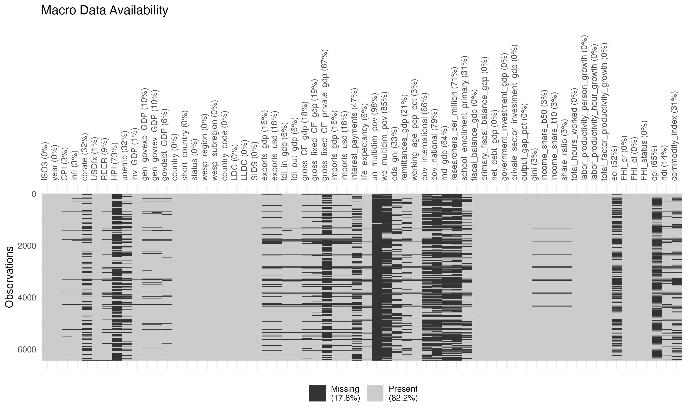

# Macroeconomic panel dataset

used for a panel analysis at the [United Nations Global Economic Monitoring Brach](https://policy.desa.un.org/about-us/global-economic-monitoring-branch)

Collects various variables, e.g:

- **Macro**: GDP, output gap, ...
- **Fiscal**: Government debt, Primary balance, ...
- **Labor:** Productivity growth, annual hours worked, ...
- **Inequality**: Gini, Top 10% income share, ...
- **Trade**, **Poverty**, **Investment**, **Socioeconomic**, ...
- full list of variables available further below


We construct a country-specific commodity price influence index, inspired by [Deaton and Miller (1995)](https://econpapers.repec.org/paper/fthprinfi/79.htm) and [Collier and Goderis (2012)](https://www.sciencedirect.com/science/article/pii/S0014292112000505). For further information on the index take a look at the [explanation](./data/02_commodity/README.md).

## Meta

Commented repository structure

```
├── 12 Panel Project.Rproj     # R Project File
├── README.md 
├── data
│   ├── processed              # Processed Data
│   └── raw                    # Raw Data
│       └── BACI_HS92_V202501  # BACI Trade Data
├── docs
└── src
    ├── 01_data                # Data Processing Scripts
    ├── 02_commodity           # Commodity Price Index Scripts
    └── 03_analysis            # Combinationa and analysis
```

To reproduce the dataset, run the scripts in `src` in the numbered order. You will need to download some raw data files manually, as indicated in the respective scripts. 


## Variables

### Descriptive

| Code           | *Variable*        | *Unit* | *Source* |
| -------------- | ----------------- | ------ | -------- |
| ISO            | ISO Alpha 3 code  | /      | UN       |
| country        | Country Name      | /      | UN       |
| status         | Developing Status | /      | UN       |
| wesp_region    | WESP Region       | /      | DESA     |
| wesp_subregion | WESP Subregion    | /      | DESA     |
| country_code   | UN Country Code   | /      | UN       |
| LDC            | LDC Status        | Binary | FAO      |
| LLDC           | LLDC Status       | Binary | FAO      |
| SIDS           | SIDS Status       | Binary | FAO      |


### Macro

| Code           | *Variable*            | *Unit*             | *Source* |
| -------------- | --------------------- | ------------------ | -------- |
| gdp_usd        | GDP                   | US$                | WEFM     |
| gdp_growth     | GDP growth            | %                  | WEFM     |
| gdp_pc         | GDP per cap           | US$                | WEFM     |
| gdp_pc_growth  | GDP per capita growth | %                  | WEFM     |
| oda_gni        | Net ODA received      | % of GNI           | WB       |
| output_gap_pct | Output Gap            | % of Potential GDP | IMF      |


### Monetary

| Code   | *Variable*                   | *Unit*          | *Source* |
| ------ | ---------------------------- | --------------- | -------- |
| cbrate | Central Bank Policy Rate     | %               | GMD      |
| infl   | Inflation                    | % (yoy)         | GMD      |
| CPI    | CPI                          | Index, 2010=100 | GMD      |
| REER   | Real effective exchange rate | Index, 2010=100 | GMD      |
| USDfx  | USD exchange rate            | 1 USD in LC     | GMD      |


### Fiscal

| Code                       | *Variable*                     | *Unit*   | *Source*              |
| -------------------------- | ------------------------------ | -------- | --------------------- |
| govdebt_GDP                | Gov debt                       | % of GDP | GMD                   |
| gen_govrev_GDP             | Gov revenue                    | % of GDP | GMD                   |
| gen_govexp_GDP             | Gov exp                        | % of GDP | GMD                   |
| inv_GDP                    | Investment                     | %of GDP  | GMD                   |
| fiscal_balance_gdp         | net Lending / borrowing        | % of GDP | Fiscal Monitor DB IMF |
| primary_fiscal_balance_gdp | Primary net Lending / Borrwing | % of GDP | Fiscal Monitor DB IMF |


### Fiscal: Debt

| *Code*                     | *Variable*           | *Unit*   | *Source*              |
| -------------------------- | -------------------- | -------- | --------------------- |
| interest_payments_gdp      | Interest Expense     | % of GDP | World Bank WDI        |
| primary_fiscal_balance_gdp | Primary Balance      | % of GDP | Fiscal Monitor DB IMF |
| fiscal_balance_gdp         | Gross Fiscal Balance | % of GDP | WDI                   |
| net_debt_gdp               | Net Debt             | % of GDP | Fiscal Monitor DB IMF |


### Labor

| *Code*                           | *Variable*                   | *Unit*                | *Source*  |
| -------------------------------- | ---------------------------- | --------------------- | --------- |
| unemp                            | Unemployment Rate            | % of population       | (via GMD) |
| labor_productivity_person_growth | Growth of Labor Productivity | per employed          | TCB       |
| labor_productivity_hour_growth   | Growth of Labor productivity | per hour worked       | TCB       |
| total_hours_worked               | Total Hours worked           | Annual hours          | TCB       |
| working_age_pop_pct              | Population ages 15-64        | % of total population | WDI       |


### Inequality

| *Code*           | *Variable*              | *Unit*            | *Source*                  |
| ---------------- | ----------------------- | ----------------- | ------------------------- |
| gini             | Gini                    | 0-1               | World Inequality Database |
| income_share_b50 | Top 10% Income Share    | % of total income | World Inequality Database |
| income_share_t10 | Bottom 50% Income Share | % of total income | World Inequality Database |
| share_ratio      | T10/B50 Ratio           |                   | Calc                      |


### Trade

| *Code*      | *Variable*                    | *Unit*      | *Source* |
| ----------- | ----------------------------- | ----------- | -------- |
| exports_usd | Exports of Goods and Services | current US$ | WDI      |
| exports_gdp | Exports of Goods and Services | % of GDP    | WDI      |
| imports_usd | Imports of Goods and Services | current US$ | WDI      |
| imports_gdp | Imports of Goods and Services | % of GDP    | WDI      |


### Poverty

| *Code*            | *Variable*                                     | *Unit*          | *Source* |
| ----------------- | ---------------------------------------------- | --------------- | -------- |
| pov_international | Population living below 2.15$ Poverty Line     | % of population | WB       |
| pov_national      | Population living below national poverty lines | % of population | WB       |
| un_multidim_pov   | Multidimensional Poverty Threshold (UNDP)      | % population    | UNDP     |
| Wb_multidim_pov   | Multidimensional Poverty (WB)                  | % of pop        | WB       |


### Investment

| *Code*                    | *Variable*                                        | *Unit*             | *Source* |
| ------------------------- | ------------------------------------------------- | ------------------ | -------- |
| fdi_in_gdp                | FDI Inflows                                       | % of GDP           | WDI      |
| gross_CF_gdp              | gross capital formation                           | % of GDP           | WDI      |
| private_investment_gdp    | Gross fixed capital formation, private Sector     | % of GDP           | ICSD IMF |
| government_investment_gdp | Gross fixed capital formation, general government | % of GDP           | ICSD IMF |
| rnd_gdp                   | R&D expenditure                                   | % of GDP           | WDI WB   |
| reseearchers_per_million  | Reseeachers in R&D                                | per million people | WDI      |


### Prices

| *Code*           | *Variable*       | *Unit*   | *Source*                     |
| ---------------- | ---------------- | -------- | ---------------------------- |
| oil_price_index  | Oil price Index  | 2016=100 | Primary Commodity Prices IMF |
| food_price_index | Food Price Index | 2016=100 | Primary Commodity Prices IMF |


### Socioeconomic

| *Code*                    | *Variable*                    | *Unit*                  | *Source* |
| ------------------------- | ----------------------------- | ----------------------- | -------- |
| life_expectancy           | Life expectancy at birth      | years                   | WDI WB   |
| school_enrollment_primary | School enrollment, primary    | % of relevant age group | WDI WB   |
| remittances_gdp           | Personal Remittances received | $ US Dollar             | WB       |


### Misc

| *Code*          | *Variable*                  | *Unit*                                       | *Source*                                                     | *Availability* |
| --------------- | --------------------------- | -------------------------------------------- | ------------------------------------------------------------ | -------------- |
| FHI_pr          | Political Rights Index      | 1-7                                          | Freedom House                                                | Full           |
| FHI_cl          | civil liberties index       | 1-7                                          | Freedom House                                                | Full           |
| FHI_status      | Freedom Status              | Free (F), Partially Free (PF), Not free (NF) | Freedom House                                                | Full           |
| eci             | Economic Complexity Index   | Ca [-3,3]                                    | OEC                                                          | 2008-2024      |
| cpi             | Corruption Perception Index | 0 - 100                                      | Transparency International                                   | 2012-2024,     |
| hdi             | Human Development Index     | 0 - 1                                        | UNDP                                                         |                |
| commodity_index | Commodity Price index       |                                              | DIY, inspired by [Collier & Goderis](https://www.sciencedirect.com/science/article/pii/S0014292112000505) | 1995-2023      |


## Variable availability 

plot produced with `visdat`


