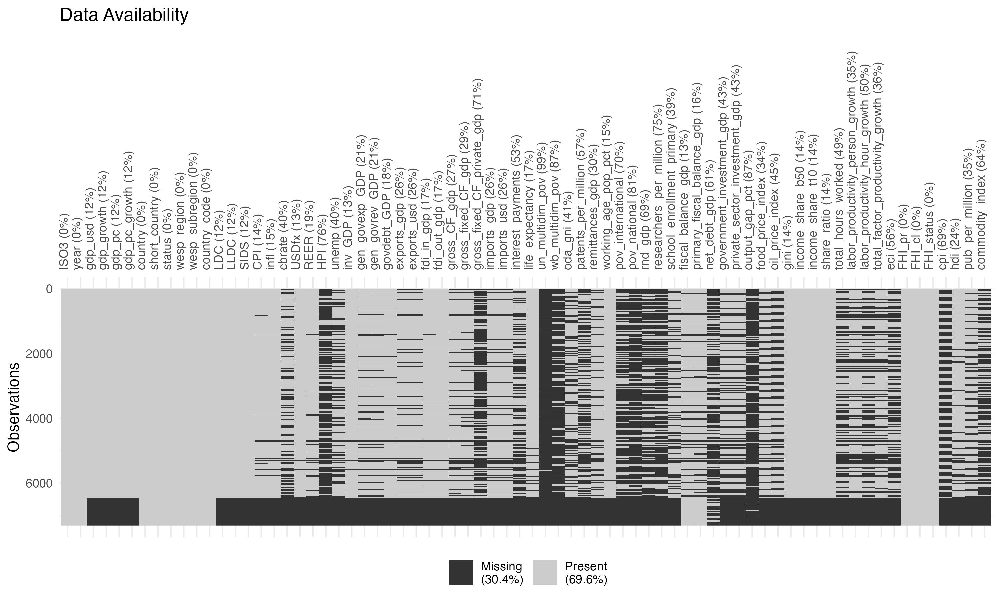
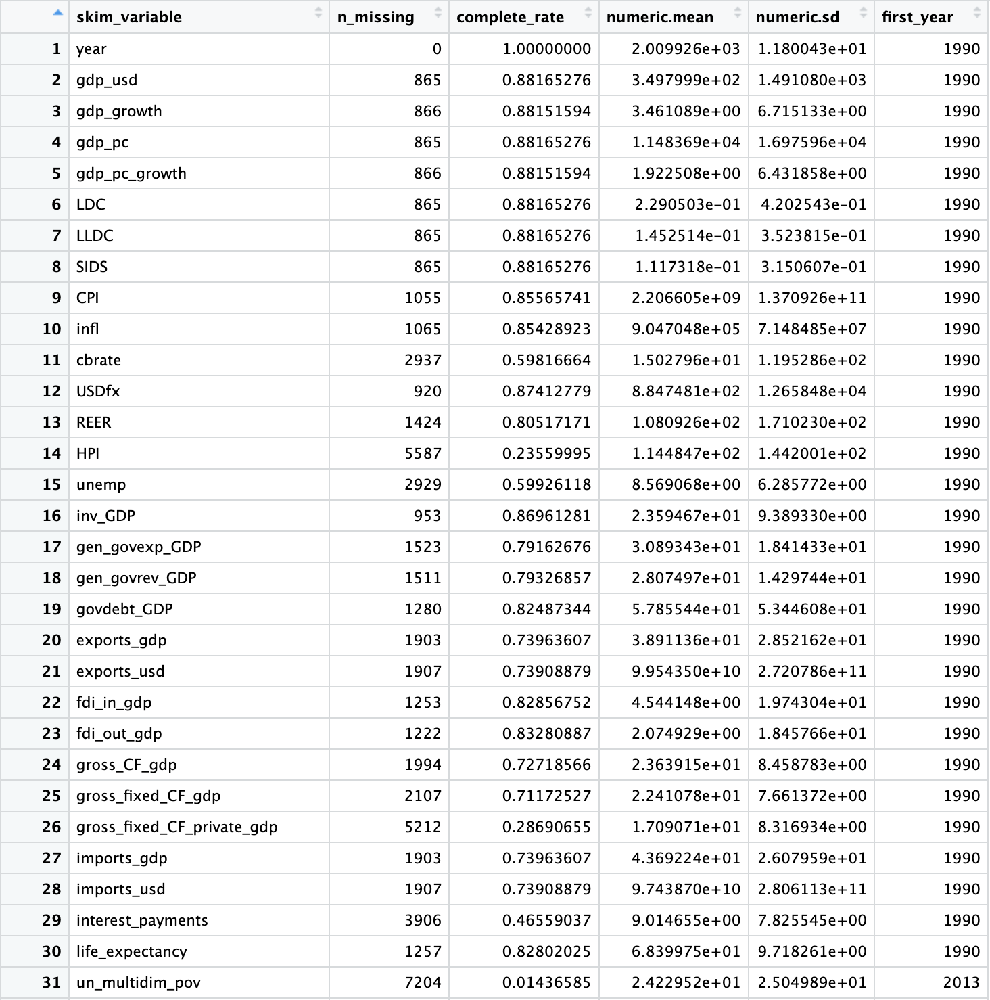
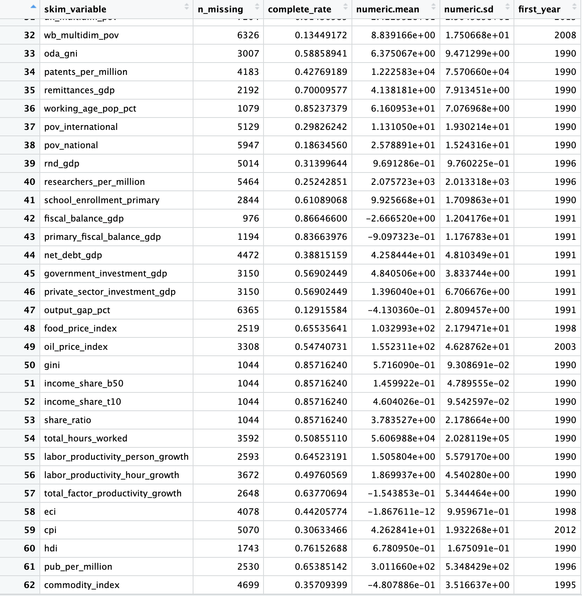

# Large Macroeconomic Panel Data (LMPD)

This repo documents the code used to create and analyze a large (macro) economic dataset, used by the [United Nations Global Economic Monitoring Brach](https://policy.desa.un.org/about-us/global-economic-monitoring-branch). The dataset includes over 70 annual variables from a broad range of topics (Macro, Labor, Fiscal, Poverty, etc). See the full list of variables below.

We also construct a country-specific commodity price influence index, inspired by [Deaton and Miller (1995)](https://econpapers.repec.org/paper/fthprinfi/79.htm) and [Collier and Goderis (2012)](https://www.sciencedirect.com/science/article/pii/S0014292112000505). For further information on the index take a look at the separate [explanation](./Commodity_Index.md).

Primary Responsibility for Code and Data: Marten W. (United Nations Global Economic Monitoring Branch)

Table of Contents:

* [Structure](#structure)
* [List of Variables](#list-of-variables)
  + [Descriptive](#descriptive)
  + [Macro](#macro)
  + [Monetary](#monetary)
  + [Fiscal](#fiscal)
  + [Labor](#labor)
  + [Inequality](#inequality)
  + [Trade](#trade)
  + [Poverty](#poverty)
  + [Investment](#investment)
  + [Innovation](#innovation)
  + [Prices](#prices)
  + [Socioeconomic](#socioeconomic)
  + [Misc](#misc)
* [Summary Statistics](#summary-statistics)


## Quickstart

*How do I get it running on my computer?*

- Go to the GitHub Repository Website (https://github.com/skriptum/macropanel) and click on "Code > Download Zip"
- Unzip the file and open the `Macropanel.Rproj` file. Rstudio should open automatically now
- Go into each folder of `src/` and run the files in the numeric order. You probably have to install some packages (indicated by Rstudio on top) to run the code

**Note:** If you only want to run the final step of combining different datasteps and producing an Excel file, go to `src/03_analysis/01_combination.qmd` and run the code. This will combine all intermediate datasets from different providers and create the final output in the `data/processed` folder: `final_data.csv`, `final_data.dta` and `innovation_data.xlsx`.


## File Explanation

*What are the different data folders?*

- `raw` is for some raw files downloaded directly from different sources that did not have an API , e.g:
  - Corruption Perception Index (Transparceny International)
  - Human Development Index (UNDP)
  - Productivity Data (Conference Board)
  - Scientific Publications per million people (Our World in Data)
  - COMTRADE Data (CEPII)
  - GEMB World Economic Forecasting Data (UN DESA)
- `intermediate` is meant for intermediate files created during the process of making the Commodity Index
- `processed`: well, as the name indicates, the processed / cleaned data. That includes for each Source the respective varaibles as well as the final combined dataset in csv and dta format

For most sources, the respective way to download the raw files is described in the Quarto Markdown Document in `src`.

```
├── 12 Panel Project.Rproj     # R Project File
├── README.md 
├── data
│   ├── processed              # Processed Data
│   ├── intermediate           # Intermediate data for the Commodity Index
│   └── raw                    # Raw Data
│       └── BACI_HS92_V202501  # BACI Trade Data
├── docs
└── src
    ├── 01_data                # Data Processing Scripts
    ├── 02_commodity           # Commodity Price Index Scripts
    └── 03_analysis            # Combinationa and analysis
```

To reproduce the dataset, run the scripts in `src` in the numbered order. You will need to download some raw data files manually, as indicated in the respective scripts. 


## List of Variables

*Whats in the dataset?*

Here, you'll find an overview of all the variables, sorted by broad category available in the final dataset (`data/processed/final_data.dta`). If you use the `.dta`file instead of the `.csv`, you also get explanations for all columns in the header. 

Abbreviations:

- GMD = [globalmacrodatabase.com](https://www.globalmacrodata.com/)
- TCB = [The Conference Board: Total Economy Database - Output, Labor and Labor Productivity](https://www.conference-board.org/topics/total-economy-database)
- WDI = [World Development Indicators](https://databank.worldbank.org/source/world-development-indicators/preview/on)
- WEFM = World Economic Forecasting Model (internal UN DESA model)

### Descriptive

| Code           | *Variable*        | *Unit* | *Source* |
| -------------- | ----------------- | ------ | -------- |
| ISO            | ISO Alpha 3 code  | /      | UN       |
| country        | Country Name      | /      | UN       |
| status         | Developing Status | /      | UN       |
| wesp_region    | WESP Region       | /      | DESA     |
| wesp_subregion | WESP Subregion    | /      | DESA     |
| country_code   | UN Country Code   | /      | UN       |
| LDC            | LDC Status        | Binary | FAO      |
| LLDC           | LLDC Status       | Binary | FAO      |
| SIDS           | SIDS Status       | Binary | FAO      |


### Macro

| Code                             | *Variable*                       | *Unit*             | *Source*  | *Source Code*     |
| -------------------------------- | -------------------------------- | ------------------ | --------- | ----------------- |
| gdp_usd                          | GDP                              | US$                | WEFM      | internal          |
| gdp_growth                       | GDP growth                       | %                  | WEFM      | internal          |
| gdp_pc                           | GDP per cap                      | US$                | WEFM      | internal          |
| gdp_pc_growth                    | GDP per capita growth            | %                  | WEFM      | internal          |
| oda_gni                          | Net ODA received                 | % of GNI           | WDI       | DT.ODA.ODAT.GN.ZS |
| output_gap_pct                   | Output Gap                       | % of Potential GDP | WEO (IMF) | NGAP_NPGDP        |
| total_factor_productivity_growth | Total factor productivity growth | %                  | TCB       | TFPG              |


### Monetary

| Code   | *Variable*                   | *Unit*          | *Source* | *Source Code* |
| ------ | ---------------------------- | --------------- | -------- | ------------- |
| cbrate | Central Bank Policy Rate     | %               | GMD      | cbrate        |
| infl   | Inflation                    | % (yoy)         | GMD      | infl          |
| CPI    | CPI                          | Index, 2010=100 | GMD      | CPI           |
| REER   | Real effective exchange rate | Index, 2010=100 | GMD      | REER          |
| USDfx  | USD exchange rate            | 1 USD in LC     | GMD      | USDfx         |


### Fiscal

| Code                       | *Variable*                     | *Unit*   | *Source*              | *Source Code*     |
| -------------------------- | ------------------------------ | -------- | --------------------- | ----------------- |
| govdebt_GDP                | Gov debt                       | % of GDP | GMD                   | govdebt_GDP |
| gen_govrev_GDP             | Gov revenue                    | % of GDP | GMD                   | gen_govrev_GDP |
| gen_govexp_GDP             | Gov exp                        | % of GDP | GMD                   | gen_govexp_GDP |
| inv_GDP                    | Investment                     | %of GDP  | GMD                   | inv_GDP |
| fiscal_balance_gdp         | net Lending / borrowing        | % of GDP | Fiscal Monitor (IMF) | GNLB_S13_POGDP_PT |
| primary_fiscal_balance_gdp | Primary net Lending / Borrwing | % of GDP | Fiscal Monitor (IMF) | GPB_S13_POGDP_PT  |
| interest_payments_gdp      | Interest Expense | % of GDP | WDI (World Bank)   | GC.XPN.INTP.ZS |
| net_debt_gdp               | Net Debt         | % of GDP | Fiscal Monitor (IMF) | G63N_S13_POGDP_PT |


### Labor

| *Code*                           | *Variable*                   | *Unit*                | *Source*         | *Source Code*     |
| -------------------------------- | ---------------------------- | --------------------- | ---------------- | ----------------- |
| unemp                            | Unemployment Rate            | % of population       | GMD              | unemp             |
| labor_productivity_person_growth | Growth of Labor Productivity | per employed          | TCB              | LP_L_g            |
| labor_productivity_hour_growth   | Growth of Labor productivity | per hour worked       | TCB              | LP_H_g            |
| total_hours_worked               | Total Hours worked           | Annual hours          | TCB              | TOTHR             |
| working_age_pop_pct              | Population ages 15-64        | % of total population | WDI (World Bank) | SP.POP.1564.TO.ZS |


### Inequality

| *Code*           | *Variable*              | *Unit*            | *Source*                  | *Source Code*   |
| ---------------- | ----------------------- | ----------------- | ------------------------- | --------------- |
| gini             | Gini                    | 0-1               | World Inequality Database | gptinc          |
| income_share_b50 | Top 10% Income Share    | % of total income | World Inequality Database | sptinc; p0p50   |
| income_share_t10 | Bottom 50% Income Share | % of total income | World Inequality Database | sptinc; p90p100 |
| share_ratio      | T10/B50 Ratio           |                   | Calc                      |                 |


### Trade

| *Code*      | *Variable*                    | *Unit*      | *Source*         | *Source Code*  |
| ----------- | ----------------------------- | ----------- | ---------------- | -------------- |
| exports_usd | Exports of Goods and Services | current US$ | WDI (World Bank) | NE.EXP.GNFS.CD |
| exports_gdp | Exports of Goods and Services | % of GDP    | WDI (World Bank) | NE.EXP.GNFS.ZS |
| imports_usd | Imports of Goods and Services | current US$ | WDI (World Bank) | NE.IMP.GNFS.CD |
| imports_gdp | Imports of Goods and Services | % of GDP    | WDI (World Bank) | NE.IMP.GNFS.ZS |


### Poverty

| *Code*            | *Variable*                                     | *Unit*          | *Source*         | *Source Code* |
| ----------------- | ---------------------------------------------- | --------------- | ---------------- | ------------- |
| pov_international | Population living below 2.15$ Poverty Line     | % of population | WDI (World Bank) | SI.POV.DDAY   |
| pov_national      | Population living below national poverty lines | % of population | WDI (World Bank) | SI.POV.NAHC   |
| un_multidim_pov   | Multidimensional Poverty Threshold (UNDP)      | % population    | WDI (World Bank) | SI.POV.MPUN   |
| Wb_multidim_pov   | Multidimensional Poverty (WB)                  | % of pop        | WDI (World Bank) | SI.POV.MPWB   |


### Investment

| *Code*                     | *Variable*                                        | *Unit*   | *Source*         | *Source Code*        |
| -------------------------- | ------------------------------------------------- | -------- | ---------------- | -------------------- |
| fdi_in_gdp                 | FDI Inflows                                       | % of GDP | WDI (World Bank) | BX.KLT.DINV.WD.GD.ZS |
| fdi_out_gdp                | FDI Outflows                                      | % of GDP | WDI (World Bank) | BM.KLT.DINV.WD.GD.ZS |
| gross_CF_gdp               | gross capital formation                           | % of GDP | WDI (World Bank) | NE.GDI.TOTL.ZS       |
| gross_fixed_CF_gdp         | Gross Fixed Capital Formation                     | % of GDP | WDI (World Bank) | NE.GDI.FTOT.ZS       |
| gross_fixed_CF_private_gdp | Gross Fixed Capital Formation, private Sector     | % of GDP | WDI (World Bank) | NE.GDI.FPRV.ZS       |
| private_investment_gdp     | Gross fixed capital formation, private Sector     | % of GDP | ICSD IMF         | P51G_PS_Q_POGDP_PT   |
| government_investment_gdp  | Gross fixed capital formation, general government | % of GDP | ICSD IMF         | P51G_S13_Q_POGDP_PT  |


### Innovation

| *Code*                  | *Variable*                                                   | *Unit*             | *Source*          | *Source Code*                                                |
| ----------------------- | ------------------------------------------------------------ | ------------------ | ----------------- | ------------------------------------------------------------ |
| rnd_gdp                 | R&D expenditure                                              | % of GDP           | WDI               | GB.XPD.RSDV.GD.ZS                                            |
| researchers_per_million | Researchers in R&D                                           | per million people | WDI               | SP.POP.SCIE.RD.P6                                            |
| patents_per_million     | Scientific Publications                                      | per Million        | WDI               | IP.PAT.RESD                                                  |
| pub_per_million         | Annual articles published in scientific and technical journals per million people | Per million people | Our World in Data | [Link](https://ourworldindata.org/grapher/scientific-publications-per-million) |


### Prices

| *Code*           | *Variable*       | *Unit*   | *Source*                       | *Source Code* |
| ---------------- | ---------------- | -------- | ------------------------------ | ------------- |
| oil_price_index  | Oil price Index  | 2016=100 | Primary Commodity Prices (IMF) | PFOOD         |
| food_price_index | Food Price Index | 2016=100 | Primary Commodity Prices (IMF) | POILAPSP      |


### Socioeconomic

| *Code*                    | *Variable*                    | *Unit*                  | *Source* | *Source Code*        |
| ------------------------- | ----------------------------- | ----------------------- | -------- | -------------------- |
| life_expectancy           | Life expectancy at birth      | years                   | WDI      | SP.DYN.LE00.IN       |
| school_enrollment_primary | School enrollment, primary    | % of relevant age group | WDI      | SE.PRM.ENRR          |
| remittances_gdp           | Personal Remittances received | $ US Dollar             | WDI      | BX.TRF.PWKR.DT.GD.ZS |


### Misc

| *Code*          | *Variable*                  | *Unit*                                       | *Source*                   | *Availability* |
| --------------- | --------------------------- | -------------------------------------------- | -------------------------- | -------------- |
| FHI_pr          | Political Rights Index      | 1-7                                          | Freedom House              | Full           |
| FHI_cl          | civil liberties index       | 1-7                                          | Freedom House              | Full           |
| FHI_status      | Freedom Status              | Free (F), Partially Free (PF), Not free (NF) | Freedom House              | Full           |
| eci             | Economic Complexity Index   | Ca [-3,3]                                    | OEC                        | 2008-2017      |
| cpi             | Corruption Perception Index | 0 - 100                                      | Transparency International | 2012-2024,     |
| hdi             | Human Development Index     | 0 - 1                                        | UNDP                       |                |
| commodity_index | Commodity Price index       |                                              | DIY                        | 1995-2023      |


## Summary Statistics

Overview plot (produced with `visdat`)



For a CSV with some summary statistics take a look at [summary_statistics.csv](./summary_statistics.csv).

|                                              |                                              |
| -------------------------------------------- | -------------------------------------------- |
|  |  |

